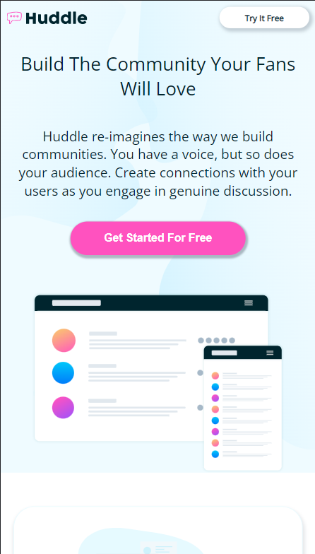
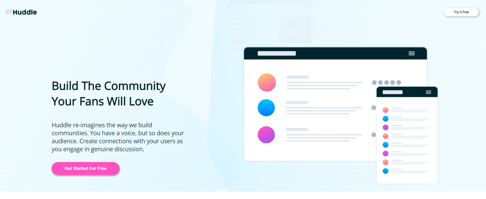

<h1 align="center">Challenge FrontEnd Mentor : Landing Page</h1>

  
 

 

Personal challenge to create a [landing page](https://www.frontendmentor.io/challenges/huddle-landing-page-with-alternating-feature-blocks-5ca5f5981e82137ec91a5100). The goal is to create a page containing a header, a body and a footer with information, images/logo/icons and links to be placed correctly. 
First application of responsive on a project. 

Mobile version : 

Computer version : 

